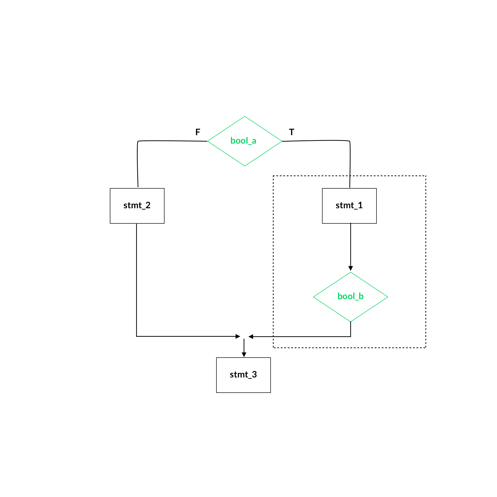

### Flowchart Review #1

```
stmt_1;
while (bool_a)
{
    if (bool_b) {
        stmt_2;
    }
} stmt_3
```


### Flowchart Review #2

```
if (bool_a){
    do {
        stmt_1;
    } while (bool_2b;
} else {
    stmt_2;
} stmt_3;
```



# Functions & Loops (50/50)

## Loops (50 pts)

### Matching Flowchart to code fragment (20 Pts)

-   10 Items, 2 Points each.

### Iterate thru the loop and calculate the value (16 pts)

-   Augmented
-   Loop Iteration
-   Pre/Post Iterate (Increment/Decrement)

### Partial Code, Fill in missing loop (14 pts)

-   What type of loop (eg. pre or post)

## Functions (50 pts)

### Calling Existing Functions (24 pts)

-   6 calls, each worth 4 pts.
-   Series of statements to construct a call to the function
-   Are the functions by value or reference?

### Write two functions (13 pts each)

-   (eg. Convert miles to kilometers)
-   Data in, data out (eg. cin << miles, cout >> km)

#### Prototype

```
double miles_to_km(double);
```

#### Call Function

```
double km = miles_to_km(67.5);
```

#### Function

```
double miles_to_km(double miles) {
    return miles * conversion_factor;
}
```

_Grading based on linkages and consistency of data types, etc._
